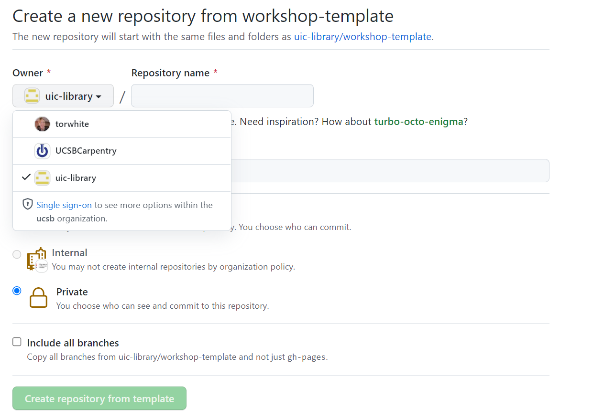
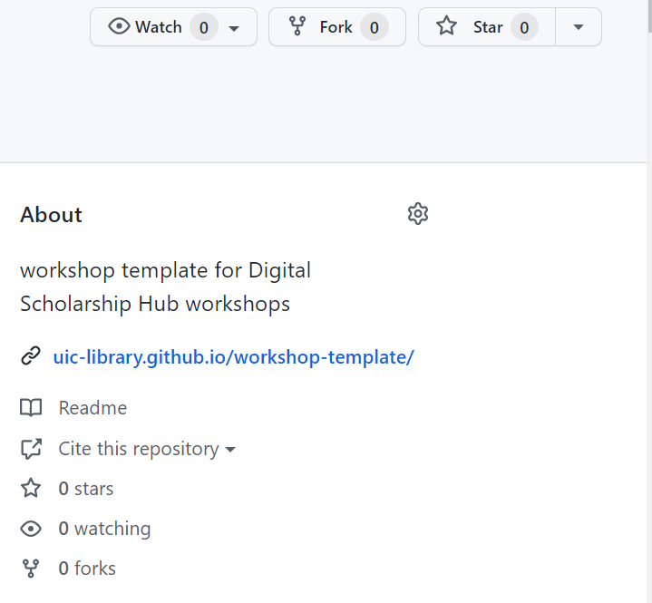
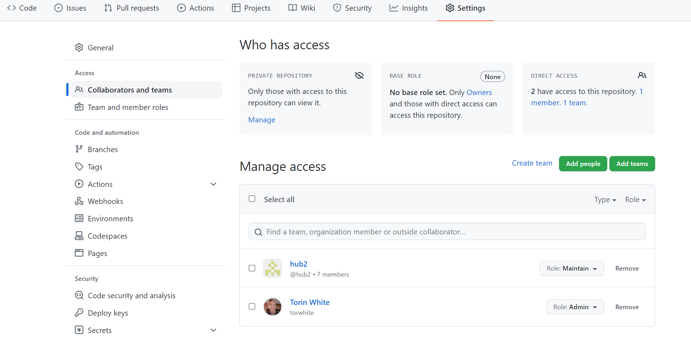
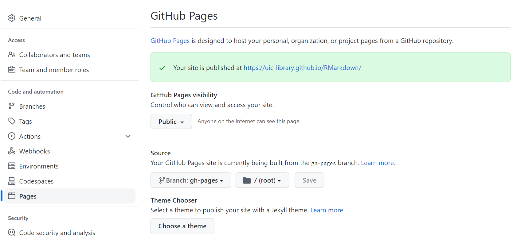
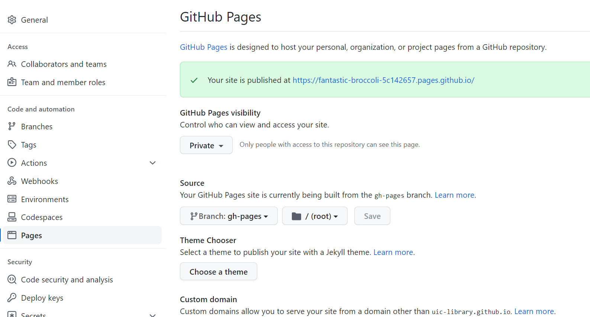
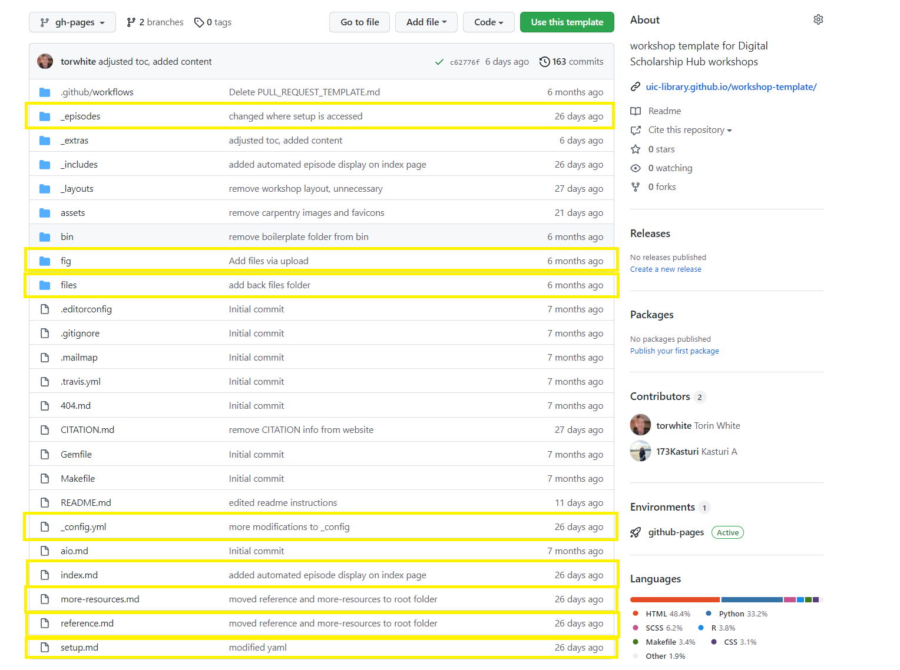
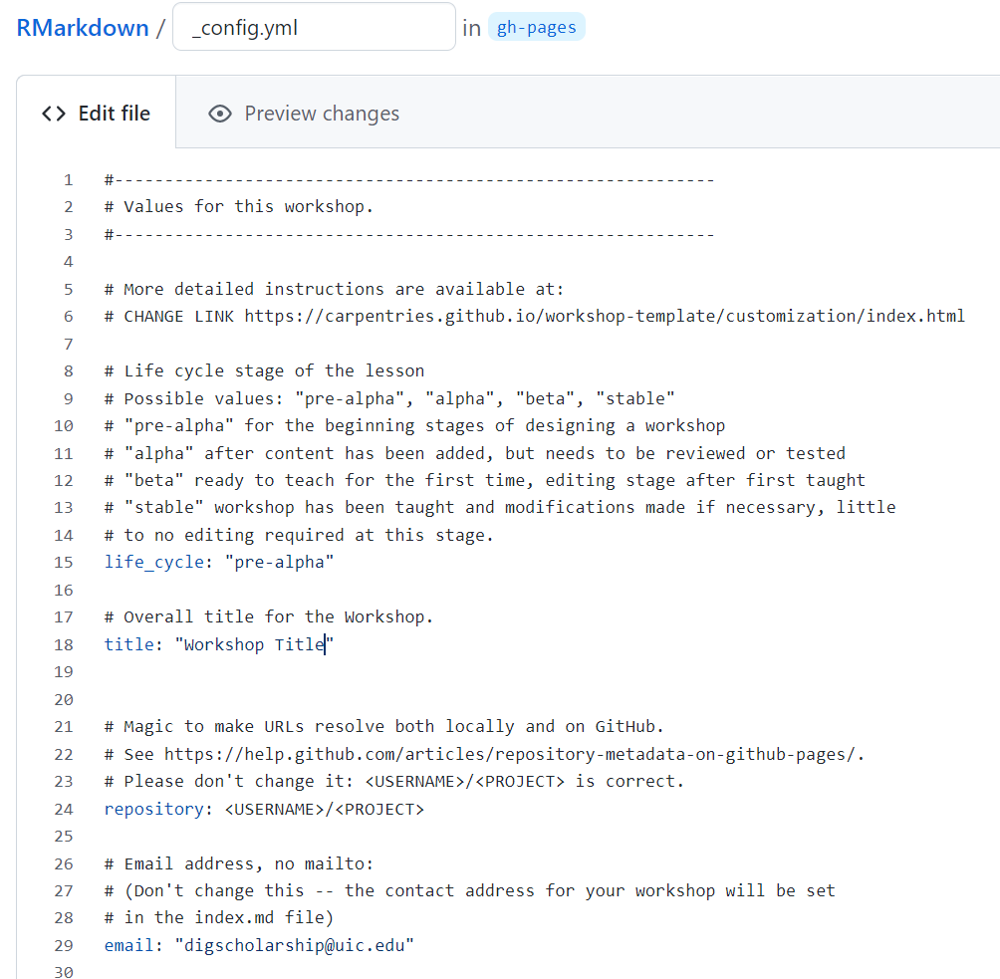
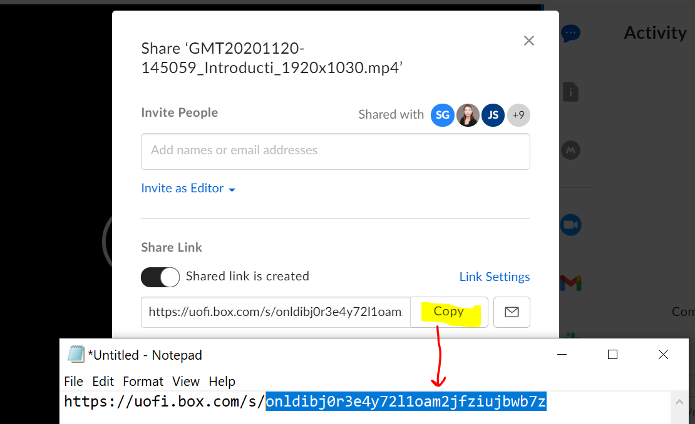

## Table of Content

* TOC
{:toc}

## Introduction

The following instructions walk through the set up steps to create a new workshop for the Digital Scholarship Hub using GitHub Pages. This workshop template is most appropriate for workshops teaching coding as the template contains styling elements for different coding languages including R, Python, BASH, SQL etc. 

### Necessary Tools

#### GitHub Account

You need to have a GitHub account. Create a GitHub account at [github.com](github.com). Send an email to lib-sys@uic.edu to be added to the `uic-library` organization and the `hub2` team. 

#### Git installation on local computer

There are several editing options explained further in the `How to edit GitHub Pages` section. Mac computers will already have git installed by default. Windows users should install `Git for Windows` if they want to work on their local computer. 

## Basics of GitHub Pages

It's recommended to review the following for working in GitHub Pages:

* Version Control with Git and GitHub
    * [Learning Git & GitHub](https://www.linkedin.com/learning/learning-git-and-github-14213624/what-is-git?autoplay=true&u=43607124)
    * [Git Essential Training: The Basics (LinkedIn Learning)](https://www.linkedin.com/learning/git-essential-training-the-basics/use-git-version-control-software-to-manage-project-code?autoplay=true&u=43607124)
* Markdown
    * [Markdown Introduction](https://www.markdownguide.org/getting-started/)
    * [Basic Markdown Syntax](https://www.markdownguide.org/basic-syntax/)
    * [GitHub Flavored Markdown](https://docs.github.com/en/get-started/writing-on-github/getting-started-with-writing-and-formatting-on-github/basic-writing-and-formatting-syntax)
    * [Code Highlighting in GitHub Markdown](https://docs.github.com/en/get-started/writing-on-github/working-with-advanced-formatting/creating-and-highlighting-code-blocks)
    * [Markdown Styling for this Template](https://carpentries.github.io/lesson-example/04-formatting/index.html) *this is where the uic library workshop template style is derived from.
* Relative paths, Absolute paths, working directory etc.
    * Relative paths are used for linking to other documents within the workshop (i.e. images or data file downloads)
    * [Absolute and Relative Paths](https://www.itgeared.com/html-absolute-relative-path-links/)
* More on GitHub Pages (if you're curious)
    * [About GitHub Pages](https://docs.github.com/en/pages/getting-started-with-github-pages/about-github-pages)
    * [Setting up a GitHub Pages Site with Jekyll](https://docs.github.com/en/pages/setting-up-a-github-pages-site-with-jekyll)
    * [Jekyll for GitHub Pages](https://jekyllrb.com/docs/github-pages/)

## GitHub Pages Workshop Website Setup

### Using the workshop template

1.  Log in to GitHub.
    You must be logged in for the remaining steps to work.

2.  On this page (<https://github.com/uic-library/workshop-template>),
    click on the green "Use this template" button (top right). **Please _do not fork this repository directly on GitHub._**
    

3.  Choose UIC Libray as the owner for the repository UNLESS you are just
    practicing or practicing with the repository (Only Admins can delete       repository's in the UIC Library's organization)
    

4. Always edit or merge edits into the `gh-pages` branch. This is the branch that will be rendered as a live website

### Repository Configurations

GitHub Pages sites are formatted as `https://GITHUB_USERNAME.github.io/REPOSITORY_NAME`.
For example, if the URL for your repository is `https://github.com/uic-library/Introduction-Digital-Scholarship`,
the URL for its website will be `http://uic-library.github.io/Introduction-Digital-Scholarship`.

* [ ] Set the site url: Your new website will be rendered at `https://uic-library.github.io/<workshop-repo-name>`. *To set the URL on GitHub, click the gear wheel button next to About on the right of the repository landing page. You will have to manually enter the url even though a repository at https://github.com/uic-library/workshop-repo-name/ will render automatically at the URL https://uic-library.github.io/<workshop-repo-name>.
* [ ] Add a description of the workshop
* [ ] [Add relevant topic tags to your lesson repository][cdh-topic-tags].



### Sharing & Visibility for Hub team

Go to Settings > Collaborators and teams

* [ ] share with hub2 (maintainer status) and the Digital Scholarship Hub faculty or staff (admin status)



### Make the Website Public

* [ ] Make GitHub Pages Public:

1) Make sure url is set according to above instructions
2) Go into settings > Pages > and choose "Public"



*until you set the url public, the website will render at random url, such as:


*Error - you may get a 404 error when you go to the site after setting it as public. That is because the browser cache is not up to date, but this will resolve within a few days. You may also resolve the issue temporarily by opening the page in an incognito window or by [forcing a reset of your browser cache](https://refreshyourcache.com/en/cache/#:~:text=To%20ensure%20you%20see%20the,clear%20the%20cache%20by%20hand.). 

### Files to edit to build workshop website

To complete the set up of your workshop you will need to edit the follow files or add files to the folders highlighted below: 



* **_config.yml** - settings for your workshop including overall title and development status
* **_index.html** - this is the home page for the site. Add information about the workshop here (description, pre-requisites, survey link, recording, etc.)
* **more-resources.md** - add additional useful resources here, such as websites that have good tutorials on the topic or books that students can read. Also can link to other Digital Scholarship Hub websites. Edit with markdown
* **reference.md** - reference the resources you used to create the workshop here, such as other tutorials you used content from. Edit in markdown
* **setup.md** - adjust the set up instructions for the workshop using this page. Edit in Markdown
* **_episodes/** - add the pages for the workshop content to this folder. 
* **fig/** - any images you use in your workshop should be saved in this folder and then linked in your workshop pages with a relative link. png, jpeg and tiff are supported.
* **files/** - add any other materials for the workshop to this folder (such as scripts, data files, etc.) May be linked in the workshop with relative links. 

## How to edit GitHub Pages

There are two ways of customizing your website. You can either:

- edit the files directly in GitHub using your web browser
- clone the repository on your computer and update the files locally

### Updating the files on GitHub in your web browser

1.  Go into your newly-created repository, ensure you are on the gh-pages branch by clicking on the branch under the drop
    down in the menu bar (see the note below):

    
2. Use the pencil icon to go into editing mode and make your edits:
    

\*Note working on your workshop online is prone to losing edits due to internet outages. Either save very frequently, or edit locally.

### Working locally

#### Command Line

If you are already familiar with Git, you can clone the repository to your desktop, edit your workshop locally, and push your changes back to the repository.

```shell
git clone https://github.com/uic-library/workshop-repo-name/
```

In order to view your changes once you are done editing, if you have bundler installed (see the
[installation instructions](https://docs.github.com/en/pages/setting-up-a-github-pages-site-with-jekyll/testing-your-github-pages-site-locally-with-jekyll), you can preview your site locally with:

```shell
make serve
```
for Macs or 

```shell
bundle exec jekyll serve
```
for Windows

and go to <http://localhost:4000> to preview your site.

If there are any issues with the edits you made, you will get an error message from jekyll. [See common jekyll error messages here](https://docs.github.com/en/pages/setting-up-a-github-pages-site-with-jekyll/troubleshooting-jekyll-build-errors-for-github-pages-sites#file-does-not-exist-in-includes-directory) to help with troubleshooting.  

Once you are satisfied with the edits to your site, commit and push the changes to your repository.
A few minutes later, you can go to the GitHub Pages URL for your workshop site and view it. 

#### GitHub Desktop App

Alternatively, you can [download and install the GitHub Desktop application](https://desktop.github.com/), though you won't be able to preview edits as you would with the command line. 

\* Highly recommend becoming comfortable using Git in command line at least for adding, commiting, previewing, and pushing changes. It can take a long time for a push to load on GitHub oneline and to be able to see the change to the website.  

## Workshop Website Detailed Instructions

### Configuration File `_config.yml`

You should edit the `_config.yml` configuration file in the root directory of your workshop to
configure some site-wide variables and make the site function correctly:

* `title` - overall title for the workshop. If set (i.e., different from "Workshop Title" or empty),
  it will appear in the "jumbotron" (the gray box at the top of the page). This variable is also
  used for the title of the extra pages. The README contains [more information about extra pages](https://github.com/carpentries/workshop-template#creating-extra-pages).

* `life-cycle` - The current development state of the workshop. 
 Possible values: "pre-alpha", "alpha", "beta", "stable"
 "pre-alpha" for the beginning stages of designing a workshop
 "alpha" after content has been added, but needs to be reviewed or tested 
 "beta" ready to teach for the first time, editing stage after first taught
 "stable" workshop has been taught and modifications made if necessary, little
 to no editing required at this stage.

You should not need to modify any of the other variable values in `_config.yml`.



### Home Page (`index.md`)

Your workshop's home page lives in `index.md`,
which must contain the following information (edited in markdown):

* [ ] add a description to the home page

* [ ] add the workshop goals to the home page

* [ ] List the pre-requisites on the home page. either workshops that students  should attend first, or concepts they should know before attending.

* [ ] add the workshop recording by navigating to where it's located in Box, copy the ID from the video sharelink (see image below) and paste into the BoxId field in the yaml in index.md

  * Alternatively, if there is no recording ready to post, comment out the recording section with `` and `` until there is a recording to add.

* [ ] update the survey link each semester. Check to make sure the correct survey is linked

* [ ] add related workshops to "Next up" section. Link related workshops that students can take next with a link []():
i.e. [Next Workshop](https://uic-library.github.io/next-workshop)

*Note workshop content will display automatically from the titles of the workshop pages, estimated times, and objectives.

### Setup Page (`setup.md`)

* [ ] add installation instructions*

* [ ] link data files, script files, or other supporting documentation

* [ ] if applicable, add a description of the data being used in the workshop so that students have context of what you will be teaching with.

*Adding and removing installation instructions

**If you need to add tools:**
 If you need to add installation instructions for other tools,
 you can use the `` statements for the tools located in `_includes/install_instructions/` folder. in the format:

 ``

 If you need to add installation instructions for tools that do not currently have installation instructions, you will need to write your own in html in the `install_instructions` folder. You can use installation instructions
 for other tools located in the `_includes/install_instructions/` folder
 as examples.

**If you need to remove tools:**

 If you need to remove any of the instructions for the default set of tools,
 you can delete lines that include these instructions in
 the `setup.md` file.

 for example, delete:

 ``

### Workshop Content Pages `_episodes/`

* [ ] make copies to match the number of parts your workshop will have by creating
  copies of `\_episodes/01-introduction.md`. Files should be named according to 
  convention: `0X-short-title.md`.
* [ ] add content to "episode" pages, and style with markdown (see [Carpentries Lesson Example](https://carpentries.github.io/lesson-example/) for styling this template
* [ ] add images for your workshop content to the `fig` folder. Good convention
  is naming each image according to the episode file it's located in `0X-short-description.png`
    \*Note: you can use png and jpeg files, but they are case sensitive, so if your file is .PNG 
    make sure to use .PNG in the markdown image link. 
* [ ] add other workshop files to the `files` folder (i.e. data files, script files) \*large data files will need to be zipped or linked to outside source, file size limit is 25 MB.


### Images `_fig/`

* [ ] add images for your workshop content to the `fig` folder. Good convention
  is naming each image according to the episode file it's located in `0X-short-description.png`
    \*Note: you can use png and jpeg files, but they are case sensitive, so if your file is .PNG 
    make sure to use .PNG in the markdown image link. 

*When linking images, usually the relative link you need is "../fig/image-to-link.png"
*When linking images (and other files), the links are file sensitive. So if you link "../fig/01-intro-picture.PNG" the file extension in the image folder must be .PNG not .png. 

### Files `files/`

* [ ] add other workshop files to the `files` folder (i.e. data files, script files) \*large data files will need to be zipped or linked to outside source, file size limit is 25 MB. 

### Additional Resources `more-resources.md`

* [ ] Add suggestions for students to this page regarding other resources that would be helpful for students to learn more on this topic. That could be websites, video tutorials books etc. Consider linking related Digital Scholarship Hub workshops here as well. 

*Should be edited with markdown

### References `reference.md`

* [ ] List and link to resources that you used to create this workshop. That could be information you referenced or used to learn the topic while developing the workshop AND materials you re-used in the workshop. Make sure at the very least you provide a reference to materials you re-used. 

*Before re-using workshop materials, make sure they are licensed for re-use.

## Troubleshooting 

### Transferring workshop to UIC Library - admin and maintainer permissions lost.

There have been issues several times when transferring a workshop from a personal GitHub account (for initial editing) to the uic-library that everyone loses administrative rights to the repository (which means the settings are totally unaccesible) If that happens, follow these steps:


1. Create a new repository in uic-library organization

2. Clone the original repository (the one with issues) locally:
    a. 
    ~~~
    git clone <insert original repository url here>

    cd <repository folder>
    ~~~
    {: .language-bash}

2. Name upstream repository (in the new repository)
    ~~~
    git remote rename origin upstream
    ~~~
    {: .language-bash}

3. Set origin as the original repository
    ~~~
    git remote add origin <original repository url>
    ~~~
    {: .language-bash}

4. Push content from original repository to the new repository on GitHub
    ~~~
    git push origin gh-pages
    ~~~
    {: .language-bash}

For more details see this [stack overflow thread]( https://stackoverflow.com/questions/5181845/git-push-existing-repo-to-a-new-and-different-remote-repo-server ) on the topic.

### Deleting a repository

Only Library Systems has rights to delete repositories. Contact lib-sys@uic.edu to request deletion. 

### Website build errors

If you see a red check next to a commit on GitHub, that means the website was not built or updated due to an error. When editing locally, jekyll will show the issue if you use the local preview option (see How to edit GitHub Pages > Working locally). Otherwise, if you are editing on GitHub, you can go to Actions and see the errors there. 

Common issues that cause build errors:
* spaces in file names
* missing file extensions
* missing end tags (in html sections or when using liquid statements)


## Workshop Template Markdown styles

The Digital Scholarship Hub workshop template was developed from the carpentries workshop template. There are extra styling and formatting options to better display code and for challenges, tips etc. 

### Formatting Code

Inline code fragments are formatted using back-quotes.
Longer code blocks are formatted by opening and closing the block with `~~~` (three tildes),
with a class specifier after the block:


    ~~~
    for thing in collection:
        do_something
    ~~~
    {: .source}


which is rendered as:

~~~
for thing in collection:
    do_something
~~~
{: .source}

The class specified at the bottom using an opening curly brace and colon,
the class identifier with a leading dot,
and a closing curly brace.
The [template]({{ site.template_repo }}) provides three styles for code blocks:

~~~
.source: program source.
~~~
{: .source}

~~~
.output: program output.
~~~
{: .output}

~~~
.error: error messages.
~~~
{: .error}

#### Syntax Highlighting

The following styles like `.source`, but include syntax highlighting for the
specified language.
Please use them where possible to indicate the type of source being displayed,
and to make code easier to read.

`.language-bash`: Bash shell commands:

~~~
echo "Hello World"
~~~
{: .language-bash}

`.language-html`: HTML source:

~~~
<html>
<body>
<em>Hello World</em>
</body>
</html>
~~~
{: .language-html}

`.language-make`: Makefiles:

~~~
all:
    g++ main.cpp hello.cpp -o hello
~~~
{: .language-make}

`.language-matlab`: MATLAB source:

~~~
disp('Hello, world!')
~~~
{: .language-matlab}

`.language-python`: Python source:

~~~
print("Hello World")
~~~
{: .language-python}

`.language-r`: R source:

~~~
cat("Hello World")
~~~
{: .language-r}

`.language-sql`: SQL source:

~~~
CREATE PROCEDURE HelloWorld AS
PRINT 'Hello, world!'
RETURN (0)
~~~
{: .language-sql}

> ## Highlighting for other languages
> You may use other `language-*` classes to activate syntax highlighting
> for other languages.
> For example,
>
> 
>     ~~~
>     title: "YAML Highlighting Example"
>     description: "This is an example of syntax highlighting for YAML."
>     array_values:
>         - value_1
>         - value_2
>     ~~~
>     {: .language-yaml }
> 
>
>
> will produce this:
>
> ~~~
> title: "YAML Highlighting Example"
> description: "This is an example of syntax highlighting for YAML."
> array_values:
>     - value_1
>     - value_2
> ~~~
> {: .language-yaml }
>
>
> Note that using `.language-*` classes other than
> `.language-bash`
> `.language-html`,
> `.language-make`,
> `.language-matlab`,
> `.language-python`,
> `.language-r`,
> or `.language-sql`
> will currently cause one of the tests in the lesson template's
> `make lesson-check` to fail for your lesson,
> but will not prevent lesson pages from building and rendering correctly.
>
{: .solution }


### Special Blockquotes

We use blockquotes to group headings and text
rather than wrapping them in `div` elements.
in order to avoid confusing [Jekyll][jekyll]'s parser
(which sometimes has trouble with Markdown inside HTML).
Each special blockquote must begin with a level-2 header,
but may contain anything after that.
For example,
a callout is formatted like this:

~~~
> ## Callout Title
>
> text
> text
> text
>
> ~~~
> code
> ~~~
> {: .source}
{: .callout}
~~~
{: .source}

(Note the empty lines within the blockquote after the title and before the code block.)
This is rendered as:

> ## Callout Title
>
> text
> text
> text
>
> ~~~
> code
> ~~~
> {: .source}
{: .callout}

The [lesson template]({{ site.template_repo }}) defines styles
for the following special blockquotes:

<div class="row">
  <div class="col-md-6" markdown="1">

> ## `.callout`
>
> An aside or other comment.
{: .callout}

> ## `.challenge`
>
> An exercise.
{: .challenge}

> ## `.checklist`
>
> Checklists.
{: .checklist}

> ## `.discussion`
>
> Discussion questions.
{: .discussion}

> ## `.keypoints`
>
> Key points of an episode.
{: .keypoints}

  </div>
  <div class="col-md-6" markdown="1">

> ## `.objectives`
>
> Episode objectives.
{: .objectives}

> ## `.prereq`
>
> Prerequisites.
{: .prereq}

> ## `.solution`
>
> Exercise solution.
{: .solution}

> ## `.testimonial`
>
> A laudatory quote from a user.
{: .testimonial}

  </div>
</div>

Note that `.challenge` and `.discussion` have the same color but different icons.
Note also that one other class, `.quotation`,
is used to mark actual quotations
(the original purpose of the blockquote element).
This does not add any styling,
but is used to prevent the checking tools from complaining about a missing class.

Most authors will only use `.callout`, `.challenge`, and `.prereq`,
as the others are automatically generated by the template.
Note that `.prereq` is meant for describing things
that learners should know before starting this lesson;
setup instructions do not have a particular style,
but are instead put on the `setup.md` page.

Note also that solutions are nested inside exercises as shown below:

~~~
> ## Challenge Title
>
> This is the body of the challenge.
>
> ~~~
> it may include some code
> ~~~
> {: .source}
>
> > ## Solution
> >
> > This is the body of the solution.
> >
> > ~~~
> > it may also include some code
> > ~~~
> > {: .output}
> {: .solution}
{: .challenge}
~~~
{: .source}

The double indentation is annoying to edit,
but the alternatives we considered and discarded are worse:

1.  Use HTML `<div>` elements for the challenges.
    Most people dislike mixing HTML and Markdown,
    and experience shows that it's all too easy to confuse Jekyll's Markdown parser.

2.  Put solutions immediately after challenges rather than inside them.
    This is simpler to edit,
    but clutters up the page
    and makes it harder for tools to tell which solutions belong to which exercises.

### Applying a Shadow to Images

By default, images in the lesson are displayed without borders or shadows.
In some circumstances, it may be desirable to make images stand out
from the background of the page,
for example, when using screenshots that include text on white background.
You can add a drop shadow effect to images by applying the
`image-with-shadow` class to them:

~~~
{: .image-with-shadow }
~~~
{: .source }

[jekyll-link-tag]: https://jekyllrb.com/docs/liquid/tags/#link

### Adding Formatted Equations

The template supports rendering of equations via [KaTeX](https://katex.org/).
This option must be activated by adding `math: true` to the `_config.yml` file 
or YAML front matter of the Markdown file where you wish to use it.

Mathematical expressions can then be added to the page content using the LaTeX syntax.

Expressions can be written inline:

~~~
Inline expressions can be added between `$` symbols, e.g. $E = Mc^2$.
~~~
{: .source}

with the result:

Inline expressions can be added between `$` symbols, e.g. $E = mc^2$.

Or as a block across multiple lines:

~~~
$$
    \lim_{x \rightarrow 0}
    \frac{
        \sin x
    } {
        x
    }
    = 1
$$
~~~
{: .source}

with the result:

$$
    \lim_{x \rightarrow 0}
    \frac{
        \sin x
    } {
        x
    }
    = 1
$$

The example above was taken from the chapter _Typesetting Mathematical Formulae_,
in [The Not So Short Introduction to LaTeX](https://tobi.oetiker.ch/lshort/lshort.pdf).
[The Mathematics chapter of the LaTeX WikiBook](https://en.wikibooks.org/wiki/LaTeX/Mathematics)
is a good reference guide for those wishing to add equations
and mathematical expressions to their lessons.
